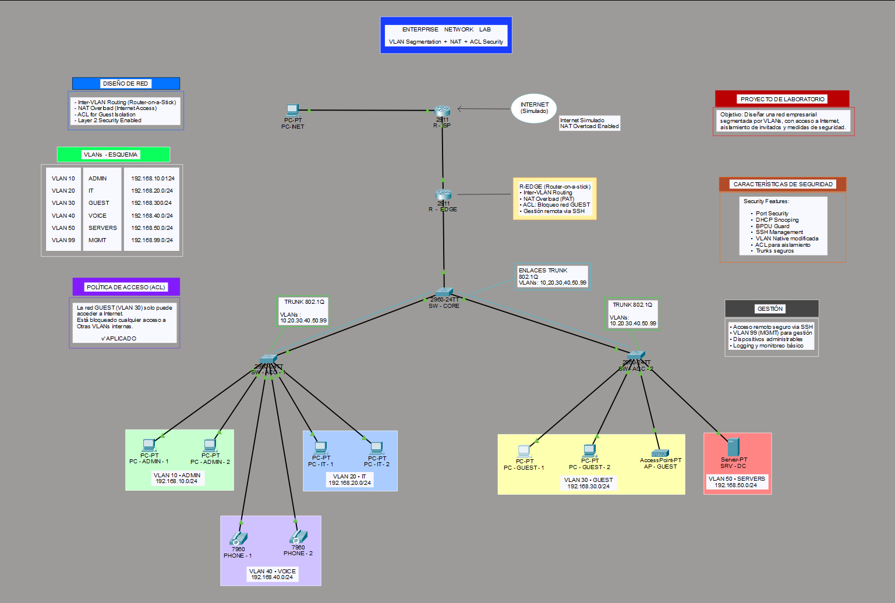
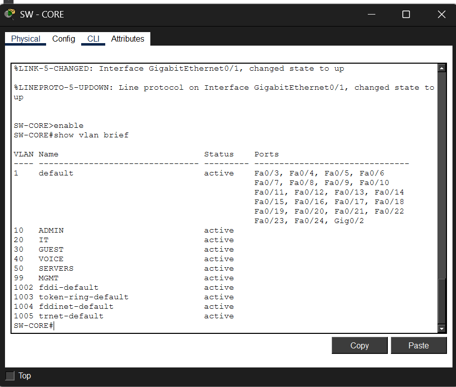
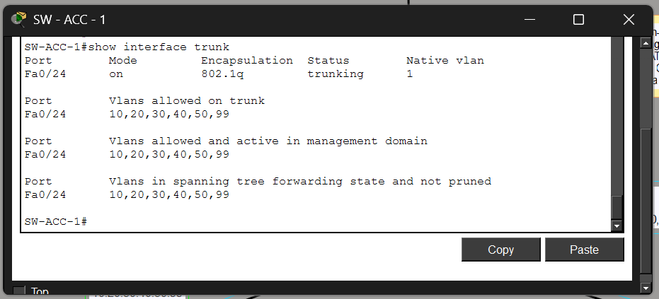
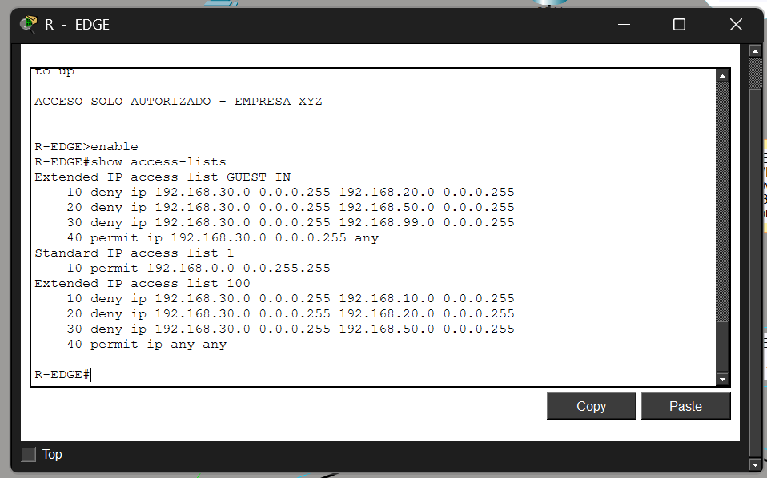
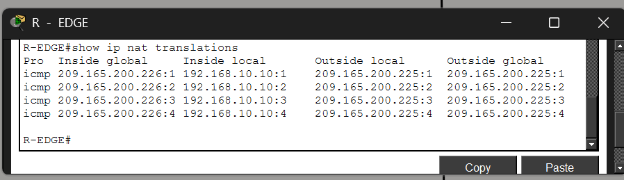
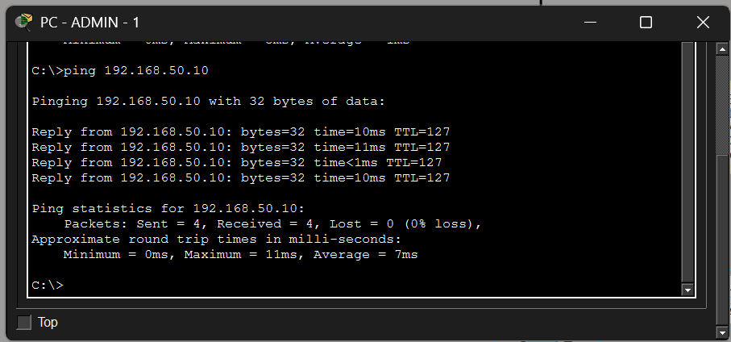
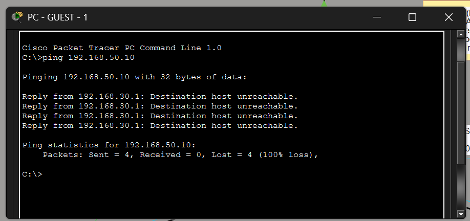
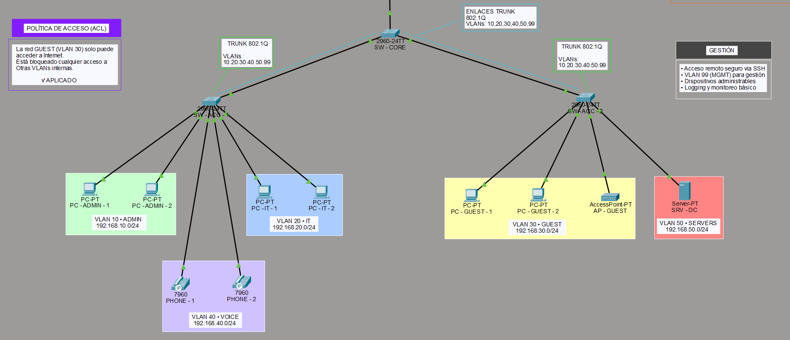

# Cisco Enterprise Network Lab

Enterprise-style Cisco Packet Tracer lab focused on VLAN segmentation, Inter-VLAN Routing, NAT, ACL Security and Layer 2 protections.
> This lab was developed between February–May 2026 during my CCNA preparation.  
> Published on GitHub on 12/05/2026 after obtaining the certification.

---

# Project Overview

This lab simulates a small enterprise network using Cisco Packet Tracer.

Main features implemented:

- VLAN Segmentation
- Router-on-a-Stick
- Inter-VLAN Routing
- NAT Overload (PAT)
- ACL Security Policies
- Port Security
- DHCP Snooping
- BPDU Guard
- SSH Remote Access
- Voice VLAN
- Trunk Links 802.1Q

---

# Network Topology

---

# VLAN Structure

| VLAN | Name    | Network            |
|------|----------|-------------------|
| 10   | ADMIN    | 192.168.10.0/24 |
| 20   | IT       | 192.168.20.0/24 |
| 30   | GUEST    | 192.168.30.0/24 |
| 40   | VOICE    | 192.168.40.0/24 |
| 50   | SERVERS  | 192.168.50.0/24 |
| 99   | MGMT     | 192.168.99.0/24 |

---

# VLAN Configuration Validation

---

# Trunk Configuration

---

# ACL Security Rules

Guest VLAN is isolated from internal networks.

Blocked access:
- VLAN 10 ADMIN
- VLAN 20 IT
- VLAN 50 SERVERS
- VLAN 99 MGMT

Allowed:
- Internet access only

---

# NAT Overload (PAT)

NAT overload configured on edge router for Internet simulation.

---

# Connectivity Validation

Successful communication between ADMIN VLAN and SERVER VLAN.

---

# Guest VLAN Isolation Test

ACL successfully blocking GUEST VLAN access to internal resources.

---

# User Access and Voice VLAN

Access layer configuration with:
- Voice VLAN
- Port Security
- Sticky MAC
- BPDU Guard
- PortFast

---

# Technologies Used

- Cisco Packet Tracer
- Cisco IOS
- VLANs
- Router-on-a-Stick
- NAT/PAT
- ACLs
- Layer 2 Security
- DHCP
- SSH

---

# Author

Jayro Leon

Cisco CCST Networking  
Cisco CCST Cybersecurity  
CCNA Path
